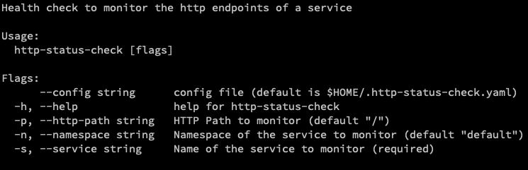

# |  |  HTTP status check |


[](https://goreportcard.com/report/github.com/sighupio/http-status-check)

## Table of Contents

1. [Overview](#overview)
1. [Getting Started](#getting-started)
   * [Installation](#installation)
   * [Usage](#usage)
     * [Usage from inside a docker image](#usage-from-inside-a-docker-image)
     * [Deploy in a cluster as a Job](#deploy-in-a-cluster-as-a-job)
     * [Examples](#examples)
1. [Developer Guide](#developer-guide)
1. [License](#license)

## Overview

http-status-check is a tool that monitors the http endpoints in a
kubernetes cluster.

The tool can be used to monitor the HTTP endpoints of a service. It
check if the service endpoints responds with an HTTP status 200 OK.
Please note that this tool only supports an in-cluster deployment. The
tool can be deployed in the following ways:

* As a Kubernetes Job accessing services in the same cluster authorized using RBAC

## Getting Started

> Please note that this tool doesn't monitor services from outside of
> the cluster since endpoint IPs won't be reachable.

### Installation

The simplest way to use the tool is to install the binary from the source repo
as follows:

* Using Go get

``` sh
$ go get -u github.com/sighupio/http-status-check/cmd/http-status-check
#
```

You should find the CLI installed in the `$GOPATH`. From this point mentioned as
`http-status-check`

### Usage

The basic usage info of the tool can be seen by using the following command:

```sh
$ http-status-check -h
Health check to monitor the http endpoints of a service

Usage:
  http-status-check [flags]

Flags:
      --KUBECONFIG string   kubeconfig file. default: in-cluster configuration, Fallback $HOME/.kube/config
      --config string       config file (default is $HOME/.http-status-check.yaml)
  -h, --help                help for http-status-check
  -p, --http-path string    HTTP Path to monitor (default "/")
      --log-level string    logging level (debug, info...) (default "info")
  -n, --namespace string    Namespace of the service to monitor (default "default")
  -s, --service string      Name of the service to monitor (required)
```



> [Refer this extended documentation on CLI usage for more](./cmd/http-status-check/README.md)

#### Usage from inside a docker image

There is a [Dockerfile bundled](./build/builder/Dockerfile) with this repo which
can be used to build a Docker image and that can be used to run the binary. To
build docker image one can use the make rule `build`. You can read more about
Makefile in [CONTRIBUTING.md](./CONTRIBUTING.md). To build the image:

``` sh
$ make build
# The docker image will be created by the name http-status-check:local-build
```

The above image can be run exactly the way the CLI is used like shown by the
code block below:

``` sh
$ docker run -it status-status-check:local-build -h
Health check to monitor the http endpoints of a service

Usage:
  http-status-check [flags]

Flags:
      --KUBECONFIG string   kubeconfig file. default: in-cluster configuration, Fallback $HOME/.kube/config
      --config string       config file (default is $HOME/.http-status-check.yaml)
  -h, --help                help for http-status-check
  -p, --http-path string    HTTP Path to monitor (default "/")
      --log-level string    logging level (debug, info...) (default "info")
  -n, --namespace string    Namespace of the service to monitor (default "default")
  -s, --service string      Name of the service to monitor (required)
$ docker run -v .kube/:/root/.kube/ -it http-status-check:local-build \
                                            --service=mypod
#
```

### Deploy in a cluster as a Job

As a part of the health check toolkit of Fury Intelligence Platform, this tool
is primary built to work as a Kubernetes Job or CronJob monitoring if TBD.
In order to do so, our preferred way of deployment is by using a
kustomization file that deploys the RBAC policy letting the job look into the
services and enpoints in a namespace and the cron job itself.

We ship the deployment files under the `deployment` directory. To
understand the usage of these files in detail head over to the [README of the
directory](./deployments/).

### Examples

TBD of example deployments that are being monitored by our
http-status-check tool can be found in the `examples` directory. Follow
the usage information in the [corresponding README](./examples/) for more info.

## Developer Guide

To set the code up locally, build, run tests, etc. Please refer the
[contributor's guide](./CONTRIBUTING.md).

## License

Check the [License here](LICENSE)
